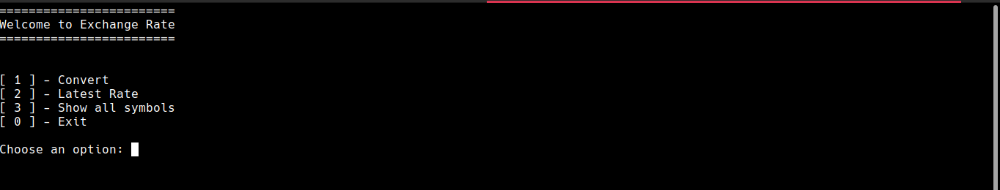

# Exchange-Rate
Exchange and latest rates

## Usage:
`python3 main.py`

Escolher uma das opções do menu principal

- 1- Voce ira selecionar a moeda base e a moeda para qual quer fazer a conversão e o montante para ser feito o calculo.
- 2- Voce ira selecionar a moeda base e a moeda para qual quer ver a ultima cotação disponivel.
- 3- Ira monstrar todas as moedas disponiveis para ser utilizada e qual seu Symbol (abreviação) para aquela moeda.

